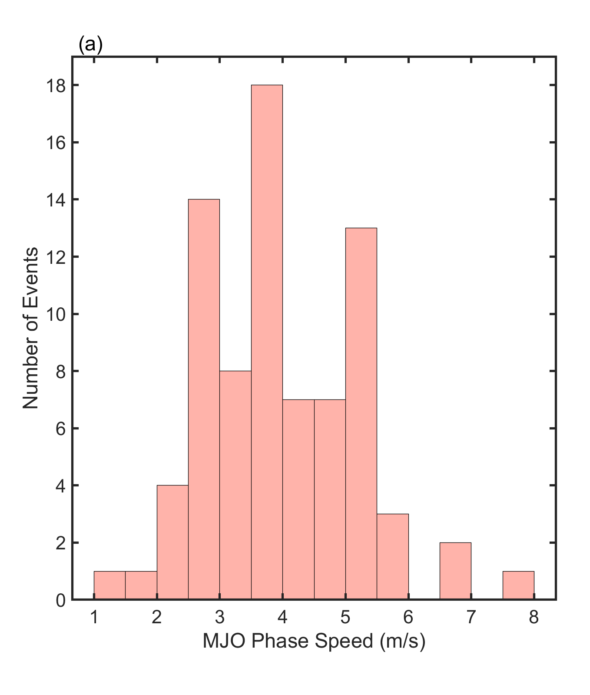
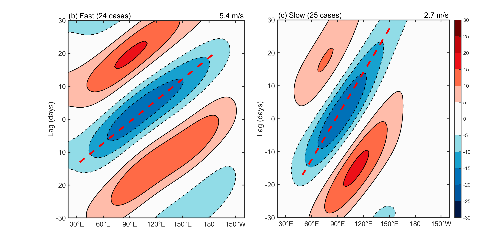

# MJO-tracking-tool

## Overview

This project provides MATLAB scripts for tracking the phase speed of Madden-Julian Oscillation (MJO) events over the equatorial region using daily OLR (Outgoing Longwave Radiation) data. The method follows the approach described in Ling et al. (2014), Zhang & Ling (2017), and Chen & Wang (2020), which allows for quantitative assessment of MJO propagation in a specific longitudinal band.

Key features:

* Objective identification of MJO events based on OLR anomalies.
* Tracking of MJO propagation within 10°S–10°N.
* Quantitative determination of phase speed, start/end dates, start/end longitudes, zonal propagation range, and event amplitude.
* Minimal human intervention due to automated trial-line and candidate-line selection.

---

## Data Preprocessing

1. **Input Data:** Daily OLR data (1979–2014) in NetCDF format (`olr.day.mean.nc`).  
2. **Leap Year Handling:** February 29 is removed to standardize each year to 365 days.  
3. **NetCDF Output:** Preprocessed OLR is saved as `olr_1979_2013.nc` and `olr_1979_2014.nc`.  
4. **Box Selection & Spectral Filtering Workflow:**  
   * Preprocessed OLR data are processed in NCL using `wkSpaceTime` for spatiotemporal spectral analysis.  
   * This analysis identifies the wavenumber–frequency–equivalent-depth ranges of the MJO and convectively coupled Kelvin waves (CCKWs).  
   * After filtering in NCL, the resulting data slices are exported to MATLAB for detailed MJO tracking.

---

## MJO Event Selection

MJO events are selected using the following criteria:

1. Compute MJO index at the reference longitude (90°E) by averaging OLR anomalies within 10°S–10°N.
2. A segment is considered an MJO event if the index is **below 1 standard deviation from the mean for five consecutive days**.
3. The date of minimum OLR anomaly during the event is defined as **t₀**.
4. For the period 1979–2013, 197 MJO events are identified, including 118 winter (NDJFMA) events.

---

## Phase Speed Tracking Method

The tracking procedure consists of the following steps:

1. **Hovmöller Plot Construction:**

   * Compute zonal mean OLR anomalies over 10°S–10°N.
   * Use 90°E as the reference longitude; the tracking domain is 20°E–140°W.

2. **Trial Lines (TL):**

   * For each reference date t ∈ [t₀–12, t₀+12], generate trial lines passing through the reference longitude.
   * Slopes correspond to phase speeds **c ∈ [1,25] m/s**, increment 0.1 m/s.
   * Each TL represents a candidate MJO propagation path.

3. **Candidate Tracking Lines (CTL):**

   * Identify TL segments where OLR anomaly is continuously **below mean minus 1 SD**.
   * Merge segments if longitude gaps ≤ 10°.
   * Each segment is a candidate tracking line.

4. **Segment Metrics:**

   * **Amplitude A(t,c):** cumulative OLR anomaly along the segment, representing convective intensity.
   * **Length L(t,c):** zonal extent of the segment, representing propagation range.

5. **Final Tracking Line Selection:**

   * Normalize amplitude and length: A/A_max and L/L_max.
   * Compute composite score: **B(t,c) = A/A_max + L/L_max**.
   * The CTL with maximum B(t,c) is selected as the final MJO propagation line.

6. **Output:**

   * Start and end dates
   * Start and end longitudes
   * Reference date t₀
   * Phase speed
   * Segment amplitude and length
   * Excel output: `PropagationInfo.xlsx` and cleaned version `PropagationInfo_prepare.xlsx`.

---

## Scripts Overview

| Script                               | Description                                                                                   |
| ------------------------------------ | --------------------------------------------------------------------------------------------- |
| `01_MJO_tracking_box_1979_2013.m`    | Preprocess OLR data for NCL power spectrum analysis (1979–2013).                              |
| `02_MJO_tracking_filter_1979_2014.m` | Preprocess OLR data for NCL filtering (1979–2014).                                            |
| `03_MJO_tracking_slice.m`            | Slice the filtered data for MJO tracking.                                                     |
| `04_MJO_tracking_algorithm.m`        | Implement the phase speed tracking algorithm following Ling et al. (2014).                    |
| `05_MJO_tracking_Hovmoller.m`        | Generate Hovmöller plots for visualization of MJO propagation.                                |

---

## Figures

Example outputs from the MJO tracking workflow:

### Histogram of MJO Phase Speeds

  

### Hovmöller Diagram for Fast vs. Slow MJO Events

  

---

## References

* Chen & Wang, 2020: *Circulation Factors Determining the Propagation Speed of the Madden–Julian Oscillation.*
* Ling et al., 2014: *Global versus Local MJO Forecast Skill of the ECMWF Model during DYNAMO.*
* Wheeler & Kiladis, 1999: *Convectively Coupled Equatorial Waves: Analysis of Clouds and Temperature in the Wavenumber–Frequency Domain.*
* Zhang & Ling, 2017: *Barrier Effect of the Indo-Pacific Maritime Continent on the MJO: Perspectives from Tracking MJO Precipitation.*

---

## License

This project is licensed under the MIT License. See the [LICENSE](LICENSE) file for details.

---
